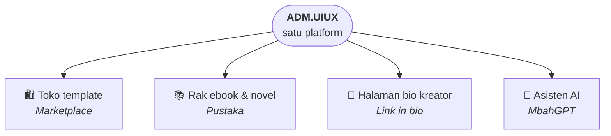

# ADM.UIUX

### Satu platform. Banyak web. Satu tempat mengelola semuanya.

Platform **multi-tenant** untuk menjalankan banyak web bisnis sekaligus, apa pun jenis
bisnisnya —
tiap domain punya wajah, niche, dan timnya sendiri, tapi berbagi satu katalog,
satu sistem pembayaran, dan satu panel.

---

## Kenapa ini ada

Menjalankan lima web niche biasanya berarti lima hosting, lima integrasi
pembayaran, lima panel admin, lima daftar member — dan lima kali kerja setiap ada
yang perlu diperbaiki. Setiap ide baru dimulai dari nol.

**ADM.UIUX membaliknya.** Semua web hidup di atas satu fondasi. Membuka web baru
bukan membuat proyek baru: daftarkan domainnya di panel, pilih tampilannya, pilih
apa yang dijual — selesai. Tanpa deploy ulang, tanpa menyalin kode.

## Tiap web berdiri sendiri. Fondasinya dipakai bersama.

| Milik tiap web | Dipakai bersama semua web |
|---|---|
| Nama, tagline, logo, ikon, palet warna | Katalog produk — satu produk bisa tampil di banyak web |
| Tampilan (template) | Checkout, pembayaran, dan invoice |
| Hero, popup, halaman legal, lowongan | Akun & login (termasuk Google) |
| Tim pengelolanya sendiri | Satu panel admin untuk semuanya |
| Penjual terverifikasi di web itu | Perlindungan konten berbayar |
| Harga & batas paket langganan | Infrastruktur — satu deployment |
| Tracking iklan & live chat | Pembaruan fitur — sampai ke semua web sekaligus |

## Satu platform, empat wajah

Tiap web memilih tampilannya sendiri, jadi web niche tidak terlihat seperti
salinan satu sama lain.

| Tampilan | Cocok untuk |
|---|---|
| **Marketplace** | Katalog campuran — barang, produk digital, jasa, langganan. Hero besar, grid produk, testimoni. |
| **Pustaka** | Niche bacaan — ebook dan novel dipajang seperti rak buku, fokus ke sampul dan judul. |
| **Link in bio** | Bio Instagram/TikTok — satu kolom tombol, semua yang dijual tinggal di-tap. |
| **MbahGPT** | Web yang produknya adalah asisten AI itu sendiri — chat penuh layar, bisa membaca gambar & PDF. |

Setiap web juga bisa di-install ke layar HP seperti aplikasi, dengan ikon dan
namanya sendiri.

## Untuk semua orang di dalamnya

**Company** — pemilik platform
- Membuka dan menutup web, menunjuk pengelolanya.
- Melihat semua web dari satu panel.

**Agent** — pengelola web
- Menjalankan satu atau beberapa web: konten, tampilan, pelanggan, penjualan.
- Bisa mendelegasikan akses fitur panel ke timnya, per web.

**Customer** — pembeli
- Preview gratis sebelum membeli.
- Bayar lewat QRIS atau e-wallet, invoice langsung masuk email.
- Download, atau baca langsung di web — tanpa aplikasi tambahan.
- Bisa naik jadi **penjual** di sebuah web setelah verifikasi identitas
  (KTP, selfie, rekening). Penjual hanya melihat penjualannya sendiri.

## Dibuat untuk jualan, bukan sekadar pajangan

- **Iklan yang terukur** — GA4, Meta Pixel, dan Meta Conversions API, tanpa konversi
  terhitung dua kali. Tiap web bisa memakai akun tracking-nya sendiri.
- **Konten berbayar aman** — preview dilindungi dari salin & simpan, dan isi berbayar
  tidak pernah dikirim ke browser sebelum dibayar.
- **Siap ditemukan** — sitemap, kartu link untuk media sosial, dan halaman produk yang
  bisa di-index, per domain.
- **Paket langganan** — Free sampai Enterprise, harga dan batasnya diatur per web.

## Visinya

Satu platform tempat setiap bisnis — toko barang, penjual produk digital, penyedia
jasa, perpustakaan digital, halaman kreator, asisten AI — berjalan sebagai
*tenant*-nya sendiri. Niche baru cukup
dikonfigurasi, bukan dibangun ulang. Semakin banyak web yang bergabung, semakin
kuat fondasi yang mereka pakai bersama.

---

**Untuk developer** → [Panduan teknis](docs/technical.md) ·
[Arsitektur](docs/architecture.md) · [Multi-domain](docs/multi-domain.md)

Dibuat oleh **ADM.UIUX** · Adam Mudianto

